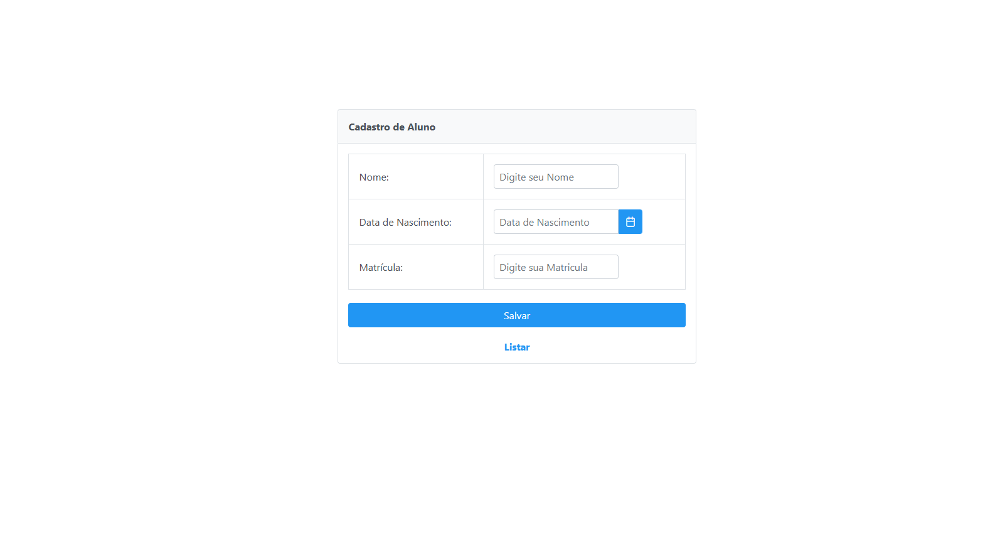
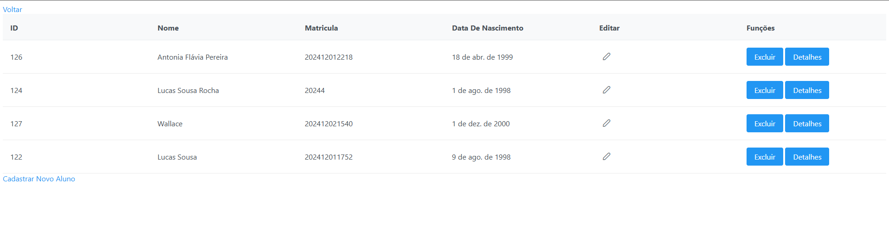
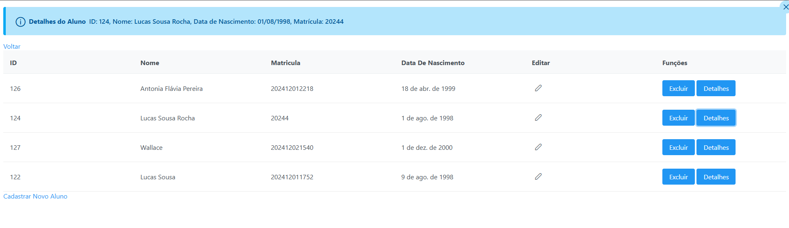
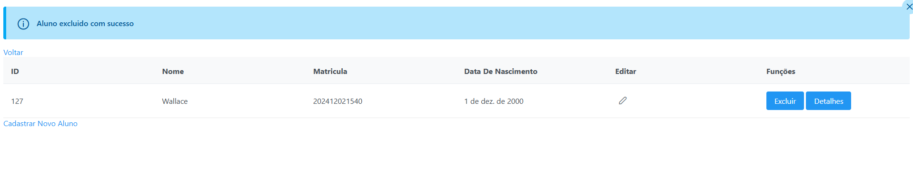

# 🚀 AP3 - Desenvolvimento de Sistemas para Web 2024.2

## 📖 Sobre o Projeto

Este projeto foi desenvolvido como parte da **AP3** da disciplina **Desenvolvimento de Sistemas para Web 2024.2**. O objetivo é implementar um sistema de gerenciamento de **alunos** com funcionalidades como **cadastro**, **listagem** e **exclusão**, e **edição** de registros, utilizando as tecnologias **JSF**, **Primefaces** e **Hibernate**.  

---

## ✨ Funcionalidades

- ✅ **Cadastro de Alunos**:  
  Página para adicionar novos alunos com campos para **ID**, **Nome**, **Data de Nascimento** e **Matrícula**.  

- ✅ **Listagem de Alunos**:  
  Exibe todos os alunos cadastrados em uma tabela interativa.

- ✅ **Exclusão de Alunos**:  
  Permite excluir registros diretamente da tabela de listagem.

- ✅ **Exibição Detalhada**:  
  Informações detalhadas de um aluno podem ser exibidas na interface.

- ✅ **Navegação**:  
  Links e botões para fácil navegação entre as páginas de **cadastro** e **listagem**.

---

## 🛠️ Tecnologias Utilizadas

- 🌐 **JSF (JavaServer Faces)**: Framework para desenvolvimento de interfaces web.  
- 🎨 **Primefaces**: Biblioteca rica de componentes UI para JSF.  
- 🏗️ **Hibernate**: Framework ORM para mapeamento objeto-relacional.  
- 📋 **JPA (Java Persistence API)**: API para persistência de dados.  

---

## 🗂️ Estrutura do Projeto

### 🔹 Classes

1. **`Aluno`**  
   - Representa os dados do aluno (ID, Nome, Data de Nascimento, Matrícula).  
   - Anotações usadas:  
     - `@Entity`  
     - `@Id`  
     - `@Column`  
     - `@GeneratedValue`  

2. **`AlunoDAO`**  
   - Métodos:
     - `salvar()`: Salva um aluno no banco de dados.  
     - `listar()`: Retorna todos os alunos cadastrados.  
     - `excluir()`: Remove um aluno pelo ID.  

3. **`JPAUtil`**  
   - Responsável por criar instâncias de `EntityManager`.

4. **`AlunoBean`**  
   - Classe que gerencia a interação entre as páginas e os métodos da camada de persistência.

### 🔹 Páginas JSF

- **`index.xhtml`**:  
  Página inicial com formulário para cadastro de alunos.

- **`listagem.xhtml`**:  
  Página para exibição dos alunos cadastrados em um `p:dataTable` com opções de exclusão e exibição de detalhes.

---

## ⚙️ Configuração do Ambiente

### ✅ Pré-requisitos

- ☕ **Java 8+**  
- 🐱‍💻 **Apache Tomcat 9+**  
- 🛢️ **Banco de Dados** (PostgreSQL ou MySQL)  
- 🛠️ **Maven**  

### 🚀 Como Executar

1. **Clone o Repositório**  
   ```bash
   git clone https://github.com/seu-usuario/nome-do-repositorio.git
   cd nome-do-repositorio
   ```

2. Configure o Banco de Dados
   ```bash
   Atualize o arquivo persistence.xml com as informações do seu banco.
   ```

3. Compile e Execute o Projeto

   ```bash
   mvn clean install
   mvn tomcat7:run
   ```

4. Acesse o Sistema Em Seu Navegador

- Página de cadastro: http://localhost:8080/index.xhtml
- Página de listagem: http://localhost:8080/listagem.xhtml

### 🖥️ Telas do Sistema

- Tela Cadastro De Aluno


- Tela De Listagem De Alunos Com as Seguintes Funcionalidades (Editar, Excluir, Exibir detalhes)


- Ao Clicar em Detalhes, Exibindo os Detalhes do Aluno Selecionado


- Mensagem de Exclusão de Usuario

### 👤 Autor
Desenvolvido por [Lucas Sousa Da Rocha] como parte da disciplina Desenvolvimento de Sistemas para Web 2024.2.